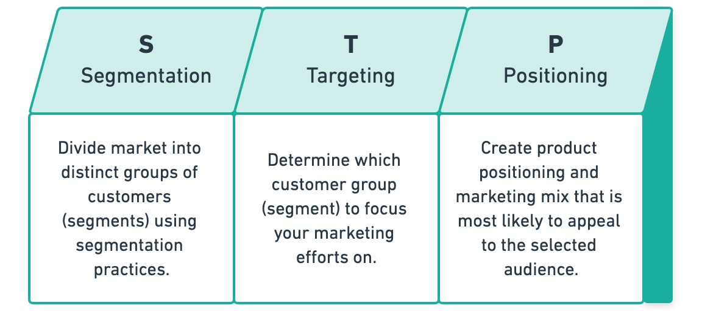
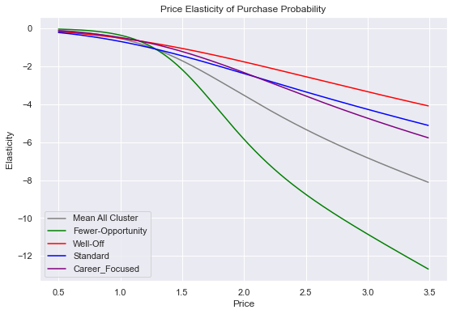

# Customer Analytics with STP approach
## Project Overview
    We use STP marketing approach to analysis and find marketing strategies. First we segment all customers into segments or clusters by doing clustering analysis with ML. Right after, we will draw insights and predict the 3 most important customer behaviors which are Will customers buy a product?, Which brands will they buy?, How many they will buy? (quantity). Finally we will use Deep Learning Model to increase the prediction accuracy of the first question (will customers buy a product?).  
<b>*Note that we do only S and P in this project because T is more of marketing and finance than analyst.*</b>

## What STP is in a nutshell:
&nbsp;&nbsp;&nbsp;&nbsp;STP marketing is an acronym for <b>Segmentation, Targeting, and Positioning</b> – a three-step model that examines your products or services as well as the way you communicate their benefits to specific customer segments.  
  
ref: https://www.yieldify.com/blog/stp-marketing-model/
  
## Data explanation
&nbsp;&nbsp;&nbsp;&nbsp;This is a data from chocolate candy bar sales a local store in FMCG (Fast-Moving Consumer Goods) market. The data was modified to protect the customer privacy. We have 2 data files in total; 1 for segmentation and 1 for analysis, and we have 2 data-legend for both dataset.  

***Please refer to the files in 'dataset' folder for full data***
  
This is an example data of <b>segmentation data</b> (dataset/segmentation data.csv):  

  
This is an example data of <b>purchase data</b> (dataset/purchase data.csv):  
  
  
## Plan to attack
1. Preprocess all data
2. Analyse the segmentation data and do clustering analysis with <b>KMeans and PCA</b>
3. Export the scaler, PCA, and KMeans model with pickle to use in another file for purchase data analysis
4. Use segments to create customers' purchase proportion with Bar chart
5. Plot other important metrics to draw some insights
6. Find <b>customers' brand choice</b> using Heatmap
7. Find the <b>store's revenue</b> from each clusters
8. Create the <b>Logistic Regression</b> model to predict <b>customers' probability</b> to buy from the price of each brand
9. Calculate <b>Price Elasticity of Purchase probability overall</b>
10. Calculate <b>Price Elasticity of Purchase probability for each cluster</b>
11. Use Logistic Regression to predict purchase probability from Promotion
12. Calculate <b>Promotion Elasticity of Purchase Probability</b>
13. Create brand choice prediction (with LogisticRegression again)
14. Calculate and visualize <b>own brand</b> and <b>cross brands</b> price elasticity for each cluster
15. Predict <b>purchase quantity</b> with <b>Linear Regression</b>

## Libraries:
numpy, scipy, pandas, sklearn, matplotlib, seaborn, pickle  

## Results
***This is a very insightful project, if we put all the results on the Github page, it will be too long to read. If you are really interested in the results, please take a look closely at all 3 .ipynb files. We wrote all the insights we found, the best-fit strategies, and all the results in there. We will provide only brief results here in Github page.***
    
&nbsp;&nbsp;&nbsp;&nbsp;We started by doing clustering analysis, before that we have to know which features would have most predictive powers. So, we use heatmap and correlation to do this.  

  
&nbsp;&nbsp;&nbsp;&nbsp;Next we will use <b>KMeans</b> clustering algorithm to do clustering analysis before that we need to know K value so we create dendrogram (take a look in the file) to find K value and we got 4. We still need to make sure of the best K values so we try diffrent values and plot the K value with its <b>WCSS</b>. And use <b>elbow method</b>  

  
&nbsp;&nbsp;&nbsp;&nbsp;After every clustering analysis, we must take a look at the result and try to name each cluster following its characteristics. In our case, we can separate the clusters into 4 cluster which are <b>0 for Standard, 1 for Fewer-Opportunity, 2 for Career-Focused, 3 for Well-Off.</b>  

  
&nbsp;&nbsp;&nbsp;&nbsp;So from the elbow method, we see 4 is the most suitable one. But after we complete clustering and plot it on the graph colored by each cluster, we see that features cannot separate the values well enough. This is the sign that we need to do PCA or feature engineering. In this case we go for PCA.  

  
&nbsp;&nbsp;&nbsp;&nbsp;When we do PCA, we have to choose the best n_features value. We use the same approach to try many values, but this time we plot against <b>cumulative sum</b>. There is no right or wrong to choose the number of components, but there is a rule of thumb good for consider number of component that can <b>contribute over 80%</b> is fine. In this case, 3 and 4 are worth trying. With values over 4 looks like to be too much.  

  
&nbsp;&nbsp;&nbsp;&nbsp;After we got the right PCA, it's a good idea to take a look at correlation heatmap again (we put this in the notebook). And plot the result of clustering analysis with PCA and KMeans.  

  
We now move on to <b>Exploratory analysis</b>  
&nbsp;&nbsp;&nbsp;&nbsp;First we take a look at <b>customer proportion</b> calculated from number of purchases. We can see the Fewer-Opportunity is our biggest customer cluster and the rest are distributed equally at around 20%.  

  
&nbsp;&nbsp;&nbsp;&nbsp;Then we take a look at some mean and std of each important indicators; average_visits, average_purchase, and purchase ratio (calculated from purchases/visits )  
  
  
&nbsp;&nbsp;&nbsp;&nbsp;Next, the important one, the brand choices for each cluster. <b>Brand 1 to Brand 5 are ordered by the price which means Brand 1 is the cheapest and Brand 5 is the most expensive brand.</b> We can that Fewer-Opportunity prefers buying Brand 2. Brand 4 for Well-Off. Brand 5 for Career-focused. Standard is quite distributed sparsely all over. Remember that one of the component from PCA is income. So this is intuitively correct.  

  
&nbsp;&nbsp;&nbsp;&nbsp;Lastly, we create DataFrame for revenue across all brands and clusters to see the big picture here.  
***This one is insightful and have some marketing stratgies to consider, please take a look in 'Customer Analytics - Purchase Data.ipynb' at the bottom most for full interpretation and details***  
  
  
That's it for data exploratory. We now move on to <b>Predictive Analytics</b>. We will use <b>Logistic Regression</b> for predicting <b>Price Elasticity of Purchase Probability</b>  
  
***Again, this part is really long and insightful, we provide only a glimpse of it. Please refer to 'Customer Analytics - Predictive Analytics.ipynb' for full interpretation and details***
  
&nbsp;&nbsp;&nbsp;&nbsp;This is the results of all price elasticity across all brands. We can see from the graph that all price elasticity is negative. Absolute value of price elasticity <b>less than 1 can infer 'inelastic'</b>. Absolute value of price elasticity <b>more than 1 can infer 'elastic'</b>. For marketing strategies, we can know at which price for which cluster that we can <b>increase the price range</b> in inelastic value and it won't affect customer purchase probability much. On the other hand, we can <b>decrease the price range</b> in elastic value to increase the purchase probability.  

  
&nbsp;&nbsp;&nbsp;&nbsp;Then we use price elasticity from Brand 5 and Brand 4 to calculate <b>cross price elasticity</b> and <b>own price elasticity</b> of Brand 5 and cross to Brand 4. Because these are are the most profitable ones, it would be nice to know the insight from each cluster.  

  
That's everything for now. This project is still ongoing. The only part left is to use Deep Learning to produce the powerful predictive models. And it will be done SOON!  
  
# Thank you for reaching out and reading til the end. YOU ARE AMAZING :D
